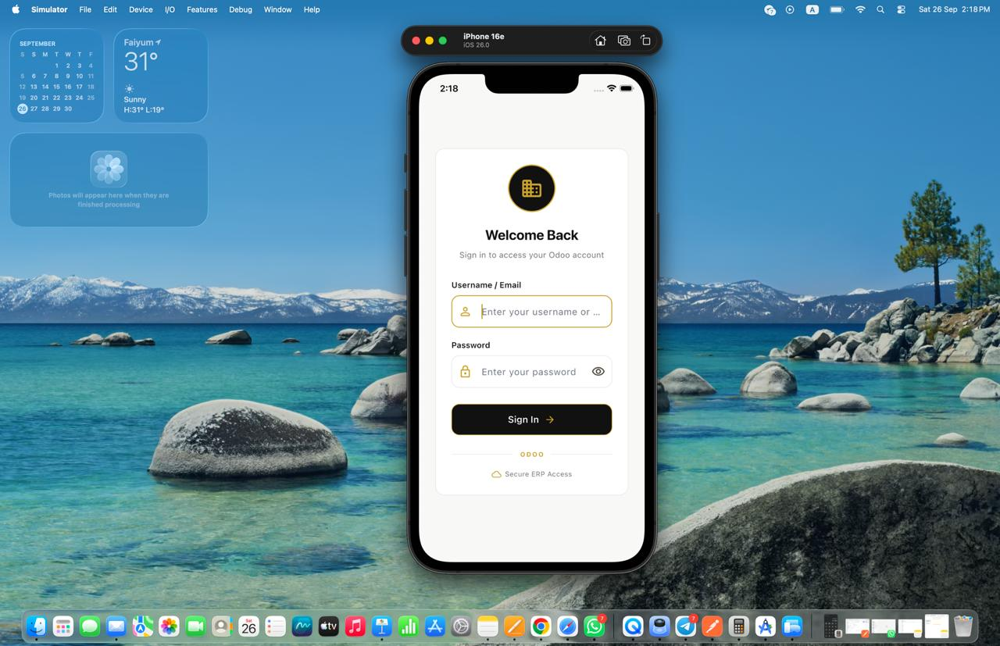
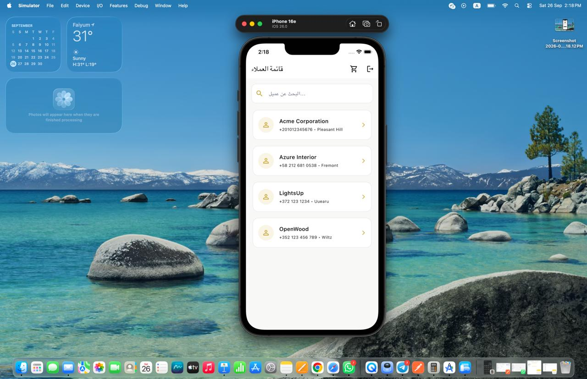
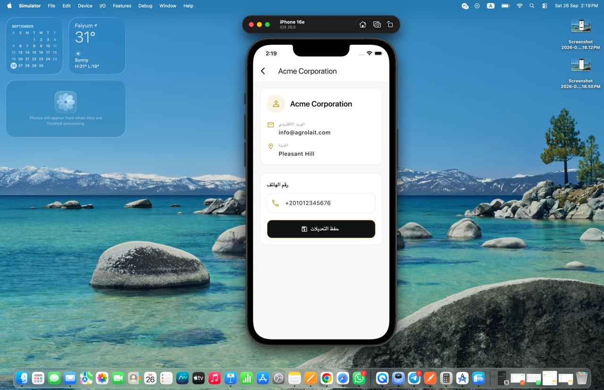
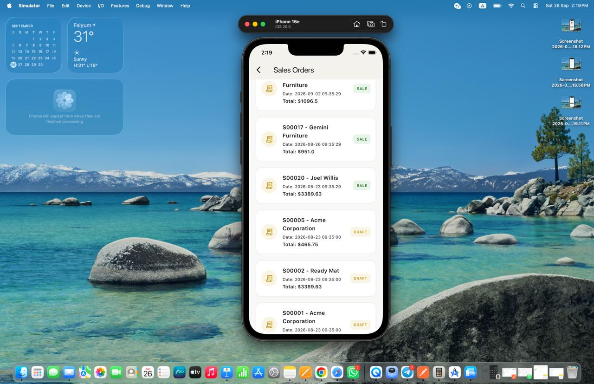
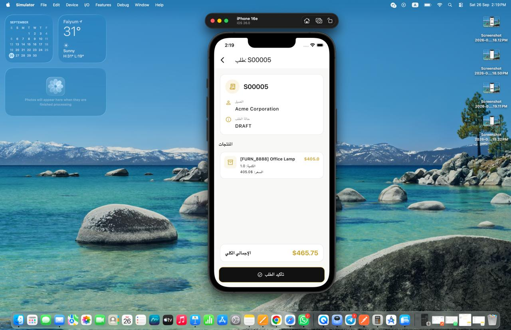

# 2sHomeWear

A Flutter mobile application for sales teams, integrated with **Odoo ERP** to manage customers and
sales orders.

The application provides a mobile interface for sales users to access customer information, update
customer data, view sales orders, and manage order details directly through Odoo.

---

## 📱 Features

### 🔐 Authentication

* Login using Odoo username and password.
* Odoo session-based authentication.
* Authentication error handling.
* Session management.

### 👥 Customer Management

* Fetch customers from Odoo.
* Display customer name, phone, and city.
* Search customers by name.
* View complete customer details.
* Update customer phone number directly in Odoo.
* Cache customer data locally using Hive.

### 🧾 Sales Orders

* View available sales orders.
* View detailed sales order information.
* Display customer information.
* Display order products and quantities.
* Display product prices and subtotals.
* Display total order amount.
* Confirm draft and sent sales orders.

### 💾 Offline Support

* Local data caching using Hive.
* Customer data can be stored locally for offline access.
* Local changes can be stored while offline.
* Pending changes can be synchronized with Odoo when connectivity is restored.

### 🎨 UI & Theme

* Material 3.
* Responsive Flutter UI.
* Centralized application theme.
* White, black, and gold visual identity.
* Centralized colors and reusable theme components.

---

## 🏗️ Architecture

The project follows a layered architecture inspired by **Clean Architecture**, separating
presentation, business logic, networking, and local database responsibilities.

```text
lib/
│
├── core/
│   ├── database/
│   │   └── Hive local database and caching
│   │
│   ├── network/
│   │   └── Odoo API client
│   │
│   └── theme/
│       ├── app_colors.dart
│       └── app_theme.dart
│
├── features/
│   │
│   ├── auth/
│   │   ├── data/
│   │   ├── logic/
│   │   └── presentation/
│   │
│   ├── customers/
│   │   ├── data/
│   │   ├── logic/
│   │   └── presentation/
│   │
│   └── sales_orders/
│       ├── data/
│       ├── logic/
│       └── presentation/
│
└── main.dart
```

---

## 🛠️ Technologies

| Technology            | Purpose                        |
|-----------------------|--------------------------------|
| **Flutter**           | Mobile application development |
| **Dart**              | Programming language           |
| **flutter_bloc**      | State management               |
| **Dio**               | HTTP networking                |
| **Odoo API**          | ERP integration                |
| **Hive**              | Local database and caching     |
| **SharedPreferences** | Local key-value storage        |
| **Material 3**        | UI design system               |
| **Git / GitHub**      | Version control                |

---

## 🔌 Odoo Integration

The application communicates with an **Odoo ERP instance** to manage business data.

The Odoo integration handles:

* User authentication.
* Customer retrieval.
* Customer search.
* Customer information updates.
* Sales order retrieval.
* Sales order details.
* Sales order confirmation.

A dedicated API client is used to keep Odoo communication separated from the UI and business logic.

### Odoo Data Flow

```text
Flutter Application
        │
        ▼
   OdooApiClient
        │
        ▼
   Odoo ERP Server
        │
        ├── Authentication
        ├── Customers
        └── Sales Orders
```

---

## 💾 Local Database & Offline Sync

The application uses **Hive** as its local database for caching and offline data persistence.

The database layer is located inside:

```text
core/database/
```

### Offline Update Flow

When the user updates a customer's phone number while offline:

```text
Offline
   │
   ▼
Update Phone
   │
   ▼
Save Local Change
   │
   ▼
Pending Update
   │
   │ Internet Restored
   ▼
Sync with Odoo
   │
   ▼
Update Successful
```

This approach allows the application to maintain a better user experience when network connectivity
is temporarily unavailable.

---

## 🔐 Authentication Flow

```text
User
 │
 ▼
Login Screen
 │
 ▼
Odoo Authentication
 │
 ├───────────────┐
 │               │
Failed          Success
 │               │
 ▼               ▼
Error        Customer List
Message           │
                  ├── Customer Details
                  │       │
                  │       └── Update Phone
                  │
                  └── Sales Orders
                          │
                          ▼
                    Order Details
                          │
                          ▼
                    Confirm Order
```

---

## 👥 Customer Flow

```text
Customer List
      │
      ├── Search by Name
      │
      └── Select Customer
              │
              ▼
       Customer Details
              │
              ▼
        Edit Phone Number
              │
              ▼
        Update Customer
              │
              ├── Online → Update Odoo
              │
              └── Offline → Save Locally
                              │
                              ▼
                         Sync Later
```

---

## 🧾 Sales Order Flow

```text
Sales Orders
      │
      ▼
Order Details
      │
      ├── Customer
      ├── Order Status
      ├── Products
      ├── Quantities
      ├── Unit Prices
      └── Total Amount
              │
              ▼
       Confirm Order
              │
              ▼
           Odoo
```

---

## 🚀 Getting Started

### Prerequisites

Make sure you have:

* Flutter SDK
* Dart SDK
* Android Studio or Xcode
* Access to an Odoo instance

### Clone the Repository

```bash
git clone https://github.com/YoussefEzzat1012/2sHomeWear.git
```

Navigate to the project:

```bash
cd 2sHomeWear
```

Install dependencies:

```bash
flutter pub get
```

Run the application:

```bash
flutter run
```

---

## ⚙️ Configuration

Configure the Odoo server URL and database name according to your Odoo environment.

Example:

```dart

final apiClient = OdooApiClient(
  baseUrl: 'https://your-odoo-server.com',
);
```

The database name should match the target Odoo instance.

> **Note:** Production Odoo credentials and private server configuration are not included in this
> repository.

---

## 🎨 App Theme

The application uses a centralized **white, black, and gold** theme.

Theme configuration:

```text
core/theme/
├── app_colors.dart
└── app_theme.dart
```

Centralizing the theme makes it easier to maintain consistent colors, typography, buttons, inputs,
cards, and other UI components throughout the application.

---

## 📸 Screenshots

### Login



### Customer List



### Customer Details



### Sales Orders



### Sales Order Details



## 🔮 Future Improvements

* Background synchronization.
* More advanced offline conflict handling.
* Automatic retry for failed synchronization requests.
* Push notifications.
* Additional sales management features.
* More comprehensive local caching.

---

## 👨‍💻 Developer

**Youssef Ezzat Abdel Alim**

Junior Flutter Developer

**GitHub:**
https://github.com/YoussefEzzat1012

**LinkedIn:**
https://linkedin.com/in/Youssef-Ezzat-0775462b9/

---

## 📄 License

This project was developed for educational and technical assessment purposes.
